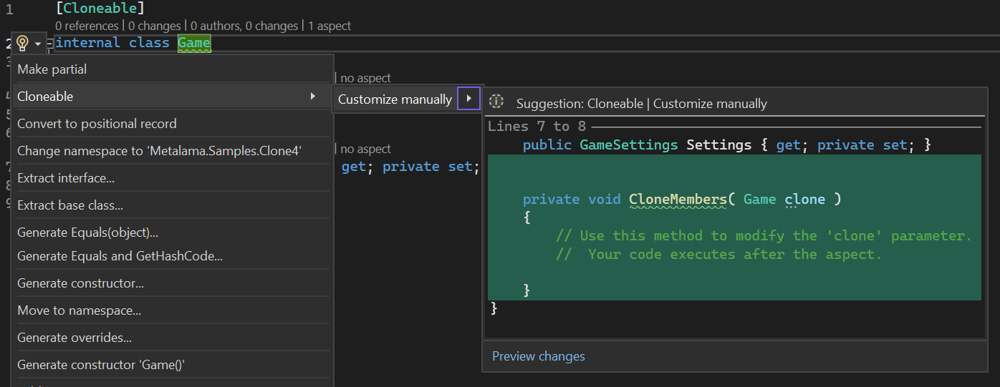
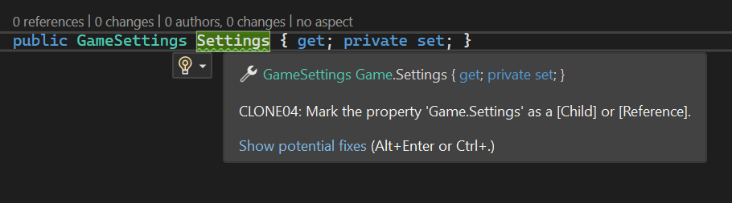
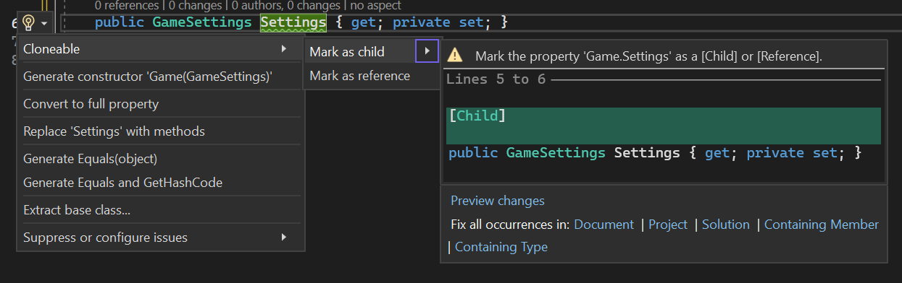

# Clone example, step 3: adding coding guidance

[!metalama-project-buttons .]

So far, we have built a powerful aspect that implements the Deep Clone pattern and has three pieces of API: the `[Cloneable]` and `[Child]` attributes and the method `void CloneMembers(T)`. Our aspect already reports errors in unsupported cases. We will now see how we can improve the productivity of the aspect's users by providing coding guidance.

First, we would like to save users from the need to remember the name and signature of the `void CloneMembers(T)` method. When there is no such method in their code, we would like to add an action to the refactoring menu that would create this action like this:

Secondly, suppose that we have deployed the `Cloneable` aspect to the team, and we notice that developers frequently forget to annotate cloneable fields with the `[Child]` attribute, causing inconsistencies in the resulting cloned object tree. Such inconsistencies are tedious to debug because they may appear randomly after the cloning process, losing much time for the team and degrading trust in aspect-oriented programming and architecture decisions. As the aspect's authors, it is our job to prevent the most frequent pitfalls by reporting a warning and suggesting remediations.

To make sure that developers do not forget to annotate properties with the `[Child]` attribute, we will define a new attribute `[Reference]` and require developers to annotate any cloneable property with either `[Child]` or `[Reference]`. Otherwise, we will report a warning and suggest two code fixes: add `[Child]` or add `[Reference]` to the field. Thanks to this strategy, we ensure that developers no longer forget to classify properties and instead make a conscious choice.

The first thing developers will experience is the warning:

Note the link _Show potential fixes_. If developers click on that link or hit `Alt+Enter` or `Ctrl+.`, they will see two code suggestions:

Let's see how we can add these features to our aspect.

## Aspect implementation

Here is the complete and updated aspect:

[!metalama-file CloneableAttribute.cs]

We will first explain the implementation of the second requirement.

### Adding warnings with two code fixes

As usual, we first need to define the error as a static field of the class:

[!metalama-file CloneableAttribute.cs member="CloneableAttribute._annotateFieldOrProperty"]

Then, we detect unannotated properties of a cloneable type. And report the warnings with suggestions for code fixes:

[!metalama-file CloneableAttribute.cs marker="ReportUnannotatedProperties"]

Notice that we used the <xref:Metalama.Framework.Diagnostics.IDiagnostic.WithCodeFixes*> method to attach code fixes to the diagnostics. To create the code fixes, we use the <xref:Metalama.Framework.CodeFixes.CodeFixFactory.AddAttribute*?text=CodeFixFactory.AddAttribute> method. The <xref:Metalama.Framework.CodeFixes.CodeFixFactory> class contains other methods to create simple code fixes.

### Suggesting CloneMembers

When we detect that a cloneable type does not already have a `CloneMembers` method, we suggest adding it without reporting a warning using the <xref:Metalama.Framework.Diagnostics.ScopedDiagnosticSink.Suggest*> method:

[!metalama-file CloneableAttribute.cs marker="SuggestCloneMembers"]

Unlike adding attributes, there is no ready-made code fix from the <xref:Metalama.Framework.CodeFixes.CodeFixFactory> class to implement this method. We must implement the code transformation ourselves and provide an instance of the <xref:Metalama.Framework.CodeFixes.CodeFix> class. This object comprises just two elements: the title of the code fix and a delegate performing the code transformation thanks to an <xref:Metalama.Framework.CodeFixes.ICodeActionBuilder>. The list of transformations that are directly available from the <xref:Metalama.Framework.CodeFixes.ICodeActionBuilder> is limited, but we can get enormous power using the <xref:Metalama.Framework.CodeFixes.ICodeActionBuilder.ApplyAspectAsync*> method, which can apply any aspect to any declaration.

To implement the code fix, we create the ad-hoc aspect class `AddEmptyCloneMembersAspect`, whose implementation should now be familiar:

[!metalama-file AddEmptyCloneMembersAspect.cs]

Note that we did not derive `AddEmptyCloneMembersAspect` from <xref:Metalama.Framework.Aspects.TypeAspect> because it would make the aspect a custom attribute. Instead, we directly implemented the <xref:Metalama.Framework.Aspects.IAspect> interface.

## Summary

We implemented coding guidance into our `Cloneable` aspect so that our users do not have to look at the design documentation so often and to prevent them from making frequent mistakes. We used two new techniques: attaching code fixes to warnings using the <xref:Metalama.Framework.Diagnostics.IDiagnostic.WithCodeFixes*?text=IDiagnostic.WithCodeFixes> method and suggesting code fixes _without_ warning using the <xref:Metalama.Framework.Diagnostics.ScopedDiagnosticSink.Suggest*> method.

> [!div class="see-also"]
> <xref:building-ide-interactions>
