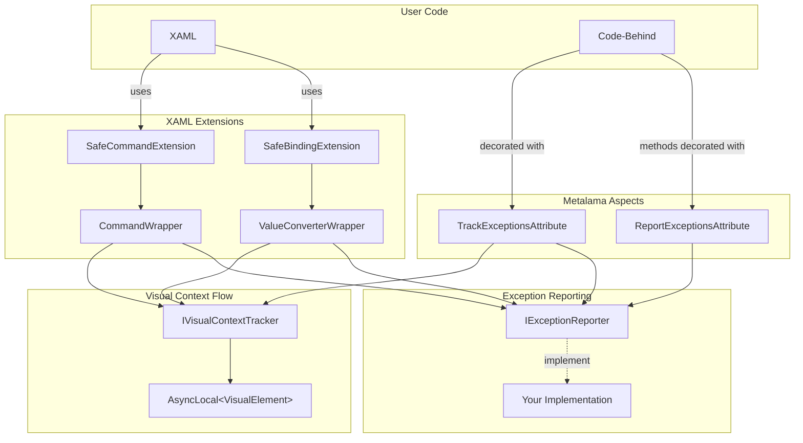
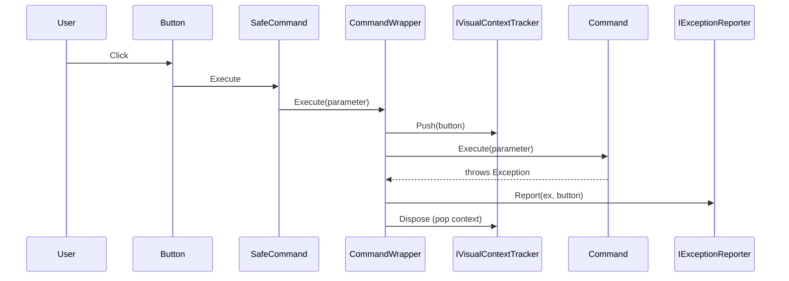

# MAUI Exception Tracking with Visual Context

This sample demonstrates how to implement comprehensive exception tracking in .NET MAUI applications with visual context awareness. When an exception occurs, the system captures which UI element caused it, even when exceptions occur in commands, bindings, or event handlers.

## The Problem

In MAUI applications, exceptions can occur in various places:
- Command execution (sync and async)
- Value converter transformations
- Event handlers

When these exceptions occur, it's often difficult to determine which UI element triggered the error. Traditional exception handling loses this context, making debugging harder.

## The Solution

This sample provides infrastructure that:
1. **Tracks visual context** using `AsyncLocal<T>` to flow context through async operations
2. **Wraps commands** to capture the source element before execution
3. **Wraps bindings** to track which element's binding caused a converter exception
4. **Uses Metalama aspects** to automatically instrument event handlers

## Architecture



## Components

### Core Infrastructure

#### IVisualContextTracker

```csharp
public interface IVisualContextTracker
{
    VisualElement? Current { get; }
    IDisposable Push(VisualElement? element);
}
```

Uses `AsyncLocal<VisualElement>` to track the current visual element. The context flows correctly through async/await calls. `Push()` returns an `IDisposable` for scoped context setting. Registered as a singleton via `UseVisualContextTracking()`.

#### IExceptionReporter

```csharp
public interface IExceptionReporter
{
    void Report(Exception ex, VisualElement? source, string? additionalContext = null);
}
```

Implement this interface to handle exceptions reported by the infrastructure. The library provides only the interface - you must register your own implementation to handle exceptions (e.g., logging, displaying to user, sending to telemetry).

### XAML Markup Extensions

#### SafeCommandExtension

```xml
<Button Command="{tracking:SafeCommand ThrowSyncCommand}" />
```

Creates a binding that wraps the command in a `CommandWrapper`. The wrapper:
- Captures the target visual element via `IProvideValueTarget`
- Sets visual context before command execution
- Catches and reports exceptions

#### SafeBindingExtension

```xml
<Label Text="{tracking:SafeBinding Counter, Converter={StaticResource FaultyConverter}}" />
```

Creates a binding with automatic exception tracking. Supports all standard binding properties:
- `Path`, `Mode`, `StringFormat`
- `Converter`, `ConverterParameter`
- `FallbackValue`, `TargetNullValue`

The converter is wrapped in `ValueConverterWrapper` which sets visual context and catches exceptions.

### Metalama Aspects

#### ReportExceptionsAttribute

Wraps methods in try/catch and reports exceptions:

```csharp
[ReportExceptions]
public void DoWork()
{
    // Exceptions are caught, reported to IExceptionReporter, then rethrown
}

[ReportExceptions(Swallow = true)]
public void DoWorkSafe()
{
    // Exceptions are caught, reported, and swallowed
}
```

#### TrackExceptionsAttribute

Type-level aspect that automatically applies exception tracking to methods. Can only be applied to types deriving from `VisualElement`.

```csharp
[TrackExceptions]
public partial class MainPage : ContentPage
{
    // Event handlers get visual context tracking + exception swallowing
    private void OnButton_Clicked(object sender, EventArgs e) { }

    // Public methods get exception reporting (rethrows for non-void, swallows for void)
    public void PublicMethod() { }

    // Protected overrides of Microsoft framework methods get exception reporting
    protected override void OnAppearing() { }

    // Other methods can opt-in with [EntryPoint]
    [EntryPoint]
    private void MyCustomEntryPoint() { }
}
```

**Method categorization and context switching:**

| Method Type | Context Source | Exception Handling |
|-------------|----------------|-------------------|
| Event handlers (`void Method(object, EventArgs)`) | `sender` parameter (if `VisualElement`) | Swallowed |
| Public instance methods | `this` (the `VisualElement` itself) | Rethrown (non-void) / Swallowed (void) |
| Protected overrides of Microsoft framework methods | `this` | Rethrown (non-void) / Swallowed (void) |
| Methods with `[EntryPoint]` | `this` | Rethrown (non-void) / Swallowed (void) |

**Design note on event handlers:** When an event handler receives a `sender` that is a `VisualElement`, the context is switched to the sender rather than `this`. This is because the sender is typically a child element (e.g., a Button) that triggered the event, and reporting exceptions against that element provides more precise diagnostic information.

#### EntryPointAttribute

Marks a method as an entry point for exception tracking when it doesn't match other criteria. Useful for callbacks that don't follow the standard event handler signature:

```csharp
[TrackExceptions]
public partial class MyPage : ContentPage
{
    private readonly SomeService _service;

    public MyPage(SomeService service)
    {
        _service = service;
        // Register callback with Action signature - not detected as event handler
        _service.OnDataReceived += HandleDataReceived;
    }

    // Without [EntryPoint], this private void method with non-standard
    // signature wouldn't be instrumented
    [EntryPoint]
    private void HandleDataReceived()
    {
        // Exceptions are tracked with visual context (this page)
    }
}
```

Cannot be applied to static methods (compile-time error MAUI0002).

#### Compile-time Diagnostics

| Code | Severity | Description |
|------|----------|-------------|
| MAUI0001 | Warning | Protected override of a Microsoft framework method is not sealed. If a derived class also overrides this method, exception handling may be inconsistent - the derived class might incorrectly assume `base.Method()` succeeded when it actually threw and swallowed the exception. Consider sealing the method. |
| MAUI0002 | Error | `[EntryPoint]` cannot be applied to a static method. Exception tracking requires an instance context to access the visual element. |

**MAUI0001 example:**

```csharp
[TrackExceptions]
public partial class BasePage : ContentPage
{
    // WARNING MAUI0001: Method is not sealed
    protected override void OnAppearing()
    {
        base.OnAppearing();
        LoadData(); // May throw
    }
}

public partial class DerivedPage : BasePage
{
    protected override void OnAppearing()
    {
        base.OnAppearing(); // If BasePage.OnAppearing throws, exception is swallowed
        // DerivedPage continues executing, unaware that LoadData() failed!
        DoMoreWork();
    }
}
```

**Fix:** Seal the framework method and provide a virtual `Core` method for derived classes:

```csharp
[TrackExceptions]
public partial class BasePage : ContentPage
{
    // No warning - method is sealed
    protected sealed override void OnAppearing()
    {
        base.OnAppearing();
        OnAppearingCore(); // Calls virtual method for derived classes
    }

    // Virtual method for derived classes - NOT instrumented (not an entry point)
    // Exceptions propagate up to OnAppearing where they are caught and reported
    protected virtual void OnAppearingCore()
    {
        LoadData();
    }
}

public partial class DerivedPage : BasePage
{
    protected override void OnAppearingCore()
    {
        base.OnAppearingCore();
        // If this throws, exception propagates to OnAppearing,
        // which catches it, reports it, and swallows it correctly
        DoMoreWork();
    }
}
```

## Data Flow



## Usage

### 1. Add the infrastructure reference

```xml
<ProjectReference Include="..\Metalama.Samples.MauiExceptionTracking\..." />
```

### 2. Configure in MauiProgram.cs

```csharp
public static MauiApp CreateMauiApp()
{
    var builder = MauiApp.CreateBuilder();
    builder
        .UseMauiApp<App>()
        .UseVisualContextTracking(); // Registers IVisualContextTracker

    // Register your IExceptionReporter implementation
    builder.Services.AddSingleton<IExceptionReporter, MyExceptionReporter>();

    return builder.Build();
}
```

### 3. Use in XAML

```xml
<ContentPage xmlns:tracking="clr-namespace:Metalama.Samples.MauiExceptionTracking;assembly=...">

    <!-- Safe command binding -->
    <Button Command="{tracking:SafeCommand MyCommand}" />

    <!-- Safe value binding with converter -->
    <Label Text="{tracking:SafeBinding Value, Converter={StaticResource MyConverter}}" />

</ContentPage>
```

### 4. Apply to code-behind

```csharp
[TrackExceptions]
public partial class MyPage : ContentPage
{
    private void OnButton_Clicked(object sender, EventArgs e)
    {
        // Automatically tracked!
    }
}
```

## Why Metalama?

The XAML markup extensions (`SafeCommand`, `SafeBinding`) handle the most common MAUI scenarios - command execution and data binding - without any Metalama involvement. So what value do the Metalama aspects add?

### What Metalama Provides

The `[TrackExceptions]` aspect automatically instruments **code-behind event handlers**. When you write:

```csharp
[TrackExceptions]
public partial class MainPage : ContentPage
{
    private void OnButton_Clicked(object sender, EventArgs e)
    {
        throw new InvalidOperationException("Something went wrong");
    }
}
```

Metalama transforms it at compile time to:

```csharp
public partial class MainPage : ContentPage
{
    private void OnButton_Clicked(object sender, EventArgs e)
    {
        VisualElement? ve = sender as VisualElement;
        using var _ = this._visualContextTracker.Push(ve);
        try
        {
            throw new InvalidOperationException("Something went wrong");
        }
        catch (Exception ex)
        {
            this._exceptionReporter.Report(ex, this._visualContextTracker.Current);
        }
    }
}
```

### Without Metalama

You would need to manually write this boilerplate for every event handler:

```csharp
private void OnButton_Clicked(object sender, EventArgs e)
{
    VisualElement? ve = sender as VisualElement;
    using var _ = _visualContextTracker.Push(ve);
    try
    {
        // Your actual code here
        throw new InvalidOperationException("Something went wrong");
    }
    catch (Exception ex)
    {
        _exceptionReporter.Report(ex, _visualContextTracker.Current);
    }
}
```

### Metalama benefits

In this sample, Metalama's value is **modest but real**:

- **Commands and bindings** (the most common MAUI patterns) are handled by markup extensions, not Metalama
- **Event handlers in code-behind** are where Metalama helps - it eliminates repetitive try/catch boilerplate
- If your app uses MVVM with few code-behind event handlers, the markup extensions alone may suffice
- If your app has many event handlers, `[TrackExceptions]` saves significant boilerplate and ensures consistent error handling

The primary benefit is **consistency** - you can't forget to add exception handling to a new event handler when the aspect applies it automatically.

### Limitation: Lambda event handlers

`[TrackExceptions]` only instruments method-based event handlers. Lambda expressions bypass the aspect:

```csharp
button.Clicked += (sender, e) => { throw new Exception("Oops"); }; // NOT guarded!
```

Detecting this at compile time would require a custom Roslyn analyzer. While Metalama's `ValidateInboundReferences` API could theoretically be used, it would be very inefficient in this scenario: MAUI's `VisualElement` and its derived types define hundreds of events across the framework, but a typical application only subscribes to a handful. `ValidateInboundReferences` indexes all references to the selected declarations, making it unsuitable when targeting a large number of external events with few actual usages.

### Limitation: XAML validation

Currently, there is no compile-time validation that `SafeBinding` and `SafeCommand` markup extensions are used in XAML instead of the standard `Binding` and `Command`. A developer could inadvertently use:

```xml
<!-- Unguarded - exceptions will crash the app -->
<Button Command="{Binding MyCommand}" />

<!-- Instead of the safe version -->
<Button Command="{tracking:SafeCommand MyCommand}" />
```

Metalama operates on C# code and cannot analyze XAML files directly. To enforce safe binding usage, a separate XAML analyzer would be necessary. This could be implemented as:

- A build-time CLI utility using regular expressions to scan `.xaml` files
- A custom MSBuild task that runs before compilation
- A Roslyn analyzer that inspects the XAML as embedded resources

This validation is outside the scope of this sample.

## Demo Application

The demo includes buttons that demonstrate:

| Button | Scenario |
|--------|----------|
| Throw Sync Exception | Synchronous command exception with visual context |
| Throw Async Exception | Async command exception (context flows through await) |
| Increment Counter | Counter binding with converter that throws when > 5 |
| Event Handler Button | Event handler exception tracked via Metalama aspect |

Captured exceptions are displayed in an alert dialog showing the visual element that caused the error.


## Building and Running

```bash
# Build for Windows
cd Metalama.Samples.MauiExceptionTracking.Demo
dotnet build

# Run
dotnet run
```

Note: The demo is configured for Windows only (`net9.0-windows10.0.19041.0`). For multi-platform support, uncomment the `TargetFrameworks` lines in the .csproj file.

## Key Concepts Demonstrated

1. **AsyncLocal for context propagation** - Context flows through async/await
2. **WeakReference for memory safety** - No memory leaks from UI element references (in demo's ExceptionReport)
3. **Markup extensions** - Custom XAML syntax for cleaner code
4. **Metalama type aspects** - Apply behavior to all methods in a class
5. **Aspect composition** - Combining multiple aspects on the same method
6. **IProvideValueTarget** - Capturing XAML target element at parse time
7. **Dependency Injection** - Services registered via `UseVisualContextTracking()`, injected into aspects via `[IntroduceDependency]`
8. **MAUI Service Provider** - Markup extensions resolve services via `VisualElement.GetMauiServiceProvider()`
